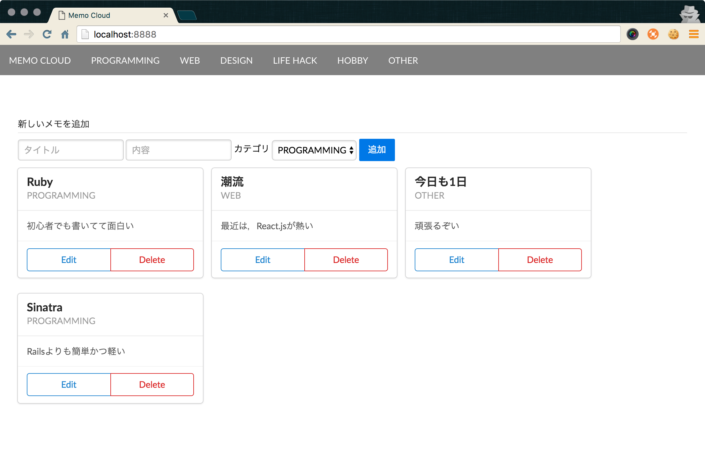
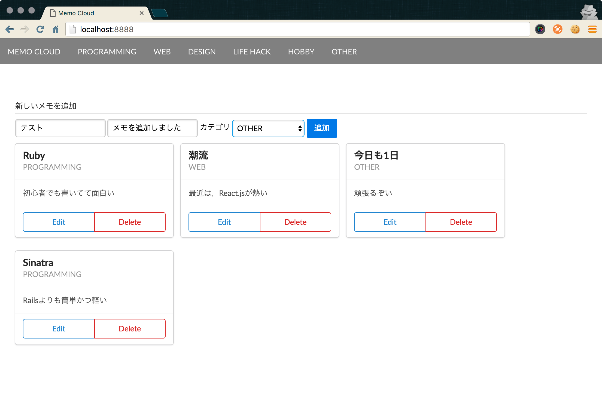
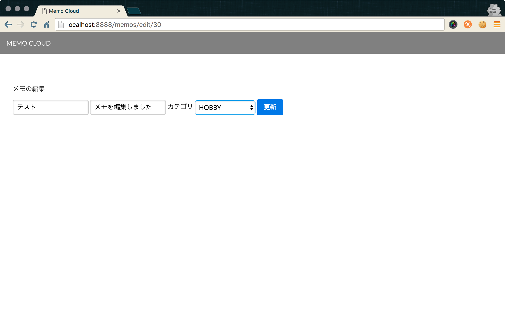
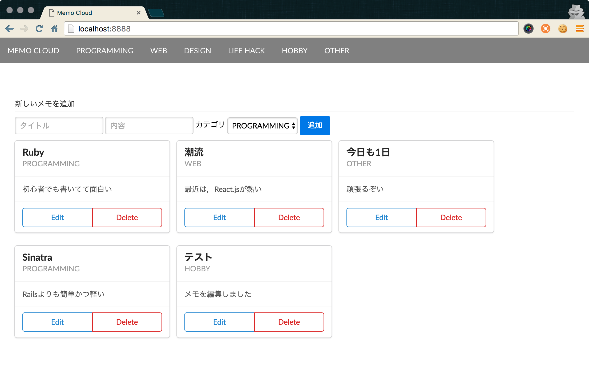
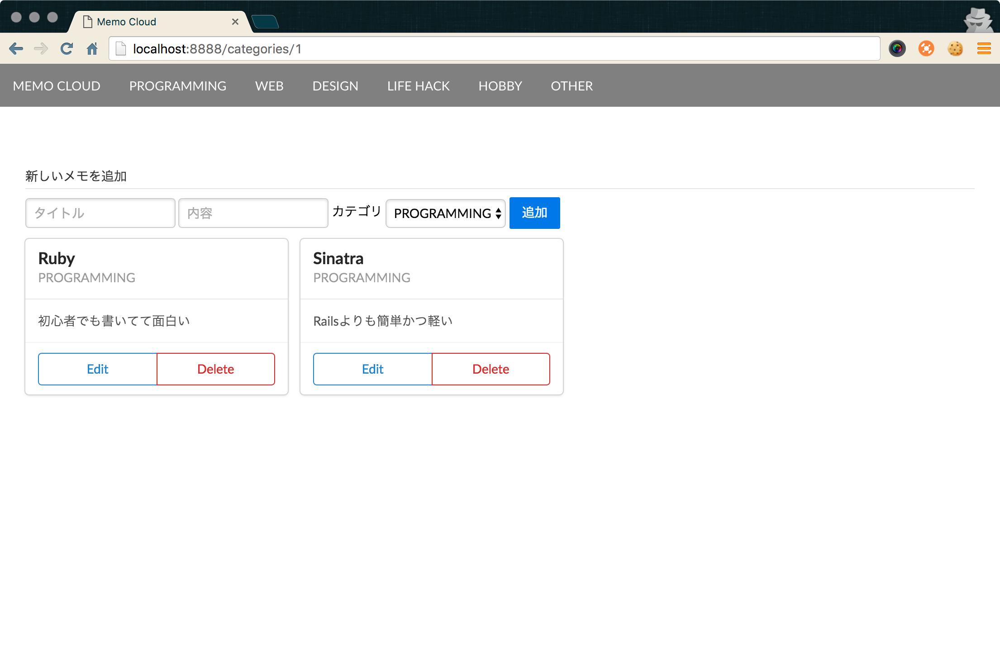

# LiT! Leaders Webサービス開発コース 確認テスト
## お題
### メモアプリケーションを作れ

## 必要要件
### モデル / データベース関連（`db/` 以下のファイル，および`models.rb`）
#### テーブルの構造
- メモに関して

| 型       | 内容           |
| :-:      | :-:            |
| 文字列   | タイトル       |
| テキスト | 内容           |
| 整数     | カテゴリID     |
| 日時型   | タイムスタンプ |

- カテゴリに関して

| 型     | 内容       |
| :-:    | :-:        |
| 文字列 | カテゴリ名 |

なお，各構造において，自動で割り振られるレコードIDは省略しています．
`schema.rb`における表現のされ方と認識してください．

#### 各モデルのアソシエーション
- 一対多の関係

### ビュー（`views/` 以下のファイル）
- index.erb
  - メモの一覧表示
  - メモの新規作成フォーム
  - メモのカテゴリ分類メニュー
- edit.erb
  - メモの編集フォーム

### コントローラ（`app.rb`）
- メモの一覧，作成，更新，削除
- メモのカテゴリ分類表示

## 点数（最大50点）

| 種類         | 点数       | 備考                       |
| :-:          | :-:        | :-:                        |
| モデル/DB    | 20点       |                            |
| ビュー       | 15点       |                            |
| コントローラ | 15点       |                            |
| LGTM         | ボーナス点 | (・∀・)ｲｲﾈ!!と思ったら1点 |

## 評価軸
### モデル / データベース
- マイグレーションファイルを要求の通り作れているか（5点）
- メモ用のモデルおよびデータベースのテーブルが作れているか（4点）
- カテゴリ用のモデルおよびデータベースのテーブルが作れているか（4点）
- メモモデルとカテゴリモデルの連携が出来ているか（4点）
- `seeds.rb`ファイルを正しく作れているか（3点）

### ビュー
- 全てのメモの一覧表示が出来ているか（3点）
- メモのなかにタイトルやカテゴリ名，内容を表示出来ているか（2点）
- メモの新規作成フォームが作れているか（2点）
- カテゴリ分類されたメモの一覧表示が出来ているか（3点）
- メモの編集リンクが正しく記述出来ているか（2点）
- メモの編集フォームが作れているか（1点）
- メモの削除リンクが正しく記述出来ているか（2点）

### コントローラ
- メモの一覧表示機能が出来ているか（3点）
- メモの新規作成機能が出来ているか（3点）
- メモの編集機能が出来ているか（3点）
- メモの削除機能が出来ているか（3点）
- メモのカテゴリ分類一覧表示機能が出来ているか（3点）

### その他
- アプリケーションが起動しない（-5点）
- マイグレーションファイルの名前が作法に則ってない（-2点）
- 余計なテーブルが出来ている（消してたらOK）（−2点）
- メモの一覧表示のレイアウトが崩れている（-2点）
- ビューとコントローラが正しく連携出来ていない（該当する各機能の点数から-1点）
- ビューやコントローラの各機能が半分程度しか出来ていない（各機能における点数の半分，なお切り捨て）
- 意味のないコードが混ざっている（-2点）
- 僕がイイネ（LGTM）と感じたら（1つにつき1点）
  - 要求以上の機能が出来ている
  - 基本的なUX等を考慮した細かな有り難さを実装している
  - インデントが綺麗に揃っている
  - などなど

## テストに取り組む流れ（参考までに）
0. メモに関するテーブルを作成する
0. メモに関するモデルの設定をする
0. メモの一覧表示機能を加える
0. メモの新規作成機能を加える
0. メモの削除機能を加える
0. メモの編集機能を加える
0. カテゴリに関するテーブルを作成する
0. カテゴリに関するモデルの設定をする
0. メモとカテゴリに関するモデルのアソシエーションを作る
0. メモのカテゴリ分類表示機能を加える

## レギュレーション
- **テストの最初に，cloud9のワークスペースに講師を招待する**
- 下記のファイルおよびディレクトリ下**以外**において，新規作成および変更の必要は必ずしもない
  - `models.rb`
  - `db/`
  - `views/`
  - `app.rb`
- カテゴリ名は自由に決めて良い
- 各ビュー（`views/`）におけるHTMLタグのクラス（`class=`）を書き換える必要は必ずしもない
- インターネット，教科書，講師への参照OK
  - ただし，**講師への参照は1回につき-1点**

## アプリケーションの実装例
### トップページ

### メモの追加

### メモの追加後のトップページ

### メモの編集

### メモの編集後のトップページ

### メモのカテゴリ分類表示

